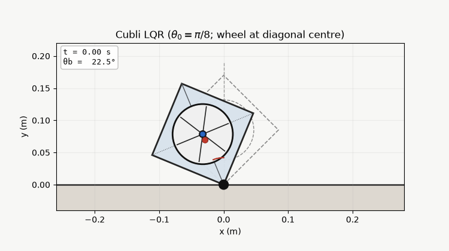

# Planar Cubli: Modeling and Control

**CP 241 — Applied Linear and Nonlinear Control (Aug 2023)** — lab project

A planar Cubli balances on a corner using a reaction wheel: motor torque spins the wheel so the body angle $\theta_b$ stays upright. This project ports the MATLAB Live Script model (Lagrangian EOM, linearization) and PID/LQR control on both linear and nonlinear plants to Python.

LQR upright balancing from $\theta_0=\pi/8$ ($22.5^{\circ}$), with $\theta_{\mathrm{des}}=0$.

---

## Symbols

| Symbol | Meaning |
|---|---|
| $l_b$ | Distance from body CoM (frame + fasteners, etc.) to the pivot |
| $l$ | Distance from wheel axis to the pivot |
| $\theta_b$ | Angle between the body diagonal (through the pivot) and the vertical |
| $\theta_w$ | Wheel rotation relative to the body |
| $I_b$ | Body moment of inertia about the pivot axis (⊥ to the plane) |
| $I_w$ | Wheel + motor-rotor inertia about the motor axis |
| $C_b$ | Dynamic friction coefficient of the body |
| $C_w$ | Dynamic friction coefficient of the wheel |
| $T_m$ | Motor torque |
| $m_b,\ m_w$ | Body and wheel masses (denoted $M_b,\ M_w$ in the code) |

---

## Kinetic energy

Body:

$$T_b = \frac{1}{2} I_b \dot{\theta}_b^2$$

Wheel (hub translation at distance $l$, plus spin):

$$T_w = \frac{1}{2} m_w \left(l\,\dot{\theta}_b\right)^2 + \frac{1}{2} I_w \left(\dot{\theta}_b + \dot{\theta}_w\right)^2$$

Total:

$$T = T_b + T_w = \frac{1}{2} I_b \dot{\theta}_b^2 + \frac{1}{2} m_w \left(l\,\dot{\theta}_b\right)^2 + \frac{1}{2} I_w \left(\dot{\theta}_b + \dot{\theta}_w\right)^2$$

## Potential energy

$$V_b = m_b\, g\, l_b\, \cos(\theta_b), \qquad V_w = m_w\, g\, l\, \cos(\theta_b)$$

$$V = V_b + V_w = (m_b l_b + m_w l)\, g\, \cos(\theta_b)$$

## Lagrangian

$$L = T - V = \frac{1}{2} I_b \dot{\theta}_b^2 + \frac{1}{2} m_w (l\dot{\theta}_b)^2 + \frac{1}{2} I_w (\dot{\theta}_b + \dot{\theta}_w)^2 - (m_b l_b + m_w l)\, g\, \cos(\theta_b)$$

---

## Euler–Lagrange equations (with friction / motor torque)

For the body coordinate $\theta_b$ (viscous friction $-C_b\dot{\theta}_b$):

$$\frac{d}{dt}\left(\frac{\partial L}{\partial \dot{\theta}_b}\right) - \frac{\partial L}{\partial \theta_b} = -C_b \dot{\theta}_b$$

$$\frac{d}{dt}\left( I_b\dot{\theta}_b + m_w l^2\dot{\theta}_b + I_w(\dot{\theta}_b + \dot{\theta}_w) \right) - (m_b l_b + m_w l)\, g\, \sin(\theta_b) = -C_b \dot{\theta}_b$$

$$I_b\ddot{\theta}_b + m_w l^2\ddot{\theta}_b + I_w(\ddot{\theta}_b + \ddot{\theta}_w) - (m_b l_b + m_w l)\, g\, \sin(\theta_b) = -C_b \dot{\theta}_b$$

For the wheel coordinate $\theta_w$ (motor torque $T_m$, friction $-C_w\dot{\theta}_w$):

$$\frac{d}{dt}\left(\frac{\partial L}{\partial \dot{\theta}_w}\right) - \frac{\partial L}{\partial \theta_w} = T_m - C_w \dot{\theta}_w$$

$$\frac{d}{dt}\left( I_w(\dot{\theta}_b + \dot{\theta}_w) \right) = T_m - C_w \dot{\theta}_w$$

$$I_w(\ddot{\theta}_b + \ddot{\theta}_w) = T_m - C_w \dot{\theta}_w$$

## Solved accelerations (nonlinear EOM)

$$\ddot{\theta}_b = \frac{(m_b l_b + m_w l)\, g\, \sin(\theta_b) - T_m + C_w\dot{\theta}_w - C_b\dot{\theta}_b}{I_b + m_w l^2}$$

$$\ddot{\theta}_w = \frac{T_m - C_w\dot{\theta}_w}{I_w} - \frac{(m_b l_b + m_w l)\, g\, \sin(\theta_b) - T_m + C_w\dot{\theta}_w - C_b\dot{\theta}_b}{I_b + m_w l^2}$$

Motor model (brushless DC torque constant):

$$T_m = K_m i, \qquad K_m = 25.1\times 10^{-3}\,\mathrm{N\cdot m\cdot A^{-1}}$$

---

## State-space form (3-state model from `topic_8`)

$$\theta_b = x_1,\quad \dot{\theta}_b = x_2,\ \ddot{\theta}_b=\dot{x}_2,\quad \dot{\theta}_w = x_3,\ \ddot{\theta}_w=\dot{x}_3$$

$$
\begin{aligned}
\dot{x}_1 &= x_2 \\
\dot{x}_2 &= \frac{(m_b l_b + m_w l)\, g\, \sin(x_1) - T_m + C_w x_3 - C_b x_2}{I_b + m_w l^2} \\
\dot{x}_3 &= \frac{T_m - C_w x_3}{I_w} - \frac{(m_b l_b + m_w l)\, g\, \sin(x_1) - T_m + C_w x_3 - C_b x_2}{I_b + m_w l^2}
\end{aligned}
$$

## Linearization at the upright equilibrium $(0,0,0)$

With $\sin(x_1)\approx x_1$, the linearized system is

$$\dot{x} = A x + B T_m, \qquad x = \begin{pmatrix} x_1 \\ x_2 \\ x_3 \end{pmatrix}$$

$$A = \begin{pmatrix} 0 & 1 & 0 \\ a_{21} & a_{22} & a_{23} \\ a_{31} & a_{32} & a_{33} \end{pmatrix}, \qquad B = \begin{pmatrix} 0 \\ b_2 \\ b_3 \end{pmatrix}$$

$$a_{21} = \dfrac{(m_b l_b + m_w l)g}{I_b + m_w l^2}, \quad a_{22} = -\dfrac{C_b}{I_b + m_w l^2}, \quad a_{23} = \dfrac{C_w}{I_b + m_w l^2}$$

$$a_{31} = -\dfrac{(m_b l_b + m_w l)g}{I_b + m_w l^2}, \quad a_{32} = \dfrac{C_b}{I_b + m_w l^2}, \quad a_{33} = -\dfrac{C_w(I_w + I_b + m_w l^2)}{I_w(I_b + m_w l^2)}$$

$$b_2 = -\dfrac{1}{I_b + m_w l^2}, \quad b_3 = \dfrac{I_w + I_b + m_w l^2}{I_w(I_b + m_w l^2)}$$

`final_project.mlx` also uses a related **4-state** model $X=[\theta_b,\ \theta_w,\ \dot{\theta}_b,\ \dot{\theta}_w]^\top$ for simulation/LQR; same Lagrangian physics.

---

## Controllers

- **PID** on $\theta_b$: $K_p=20$, $K_i=10$, $K_d=15$ (linear and nonlinear plant)
- **LQR**: $u=-KX$, desired state upright ($\theta_{\mathrm{des}}=0$)

## Run

Open `cube_bot_control.ipynb` (`numpy`, `scipy`, `matplotlib`, `ipywidgets`).

| File | Role |
|---|---|
| `cube_bot_control.ipynb` | Full derivation, PID/LQR sims, Cubli animation, interactive UI |
| `cubli_lqr.gif` | Recorded LQR balancing animation |
| `topic_8.mlx` / `final_project.mlx` | Original MATLAB sources |
| `WhatsApp Image …b943f96e.jpg` | Geometry schematic |
| `LICENSE` | MIT License |

## License

[MIT License](LICENSE).

## Reference

M. Gajamohan, M. Merz, I. Thommen, and R. D'Andrea, “The Cubli: A cube that can jump up and balance,” in *Proc. IEEE/RSJ International Conference on Intelligent Robots and Systems (IROS)*, Algarve, Portugal, 2012, pp. 3722–3727.  
DOI: [10.1109/IROS.2012.6385896](https://doi.org/10.1109/iros.2012.6385896)
